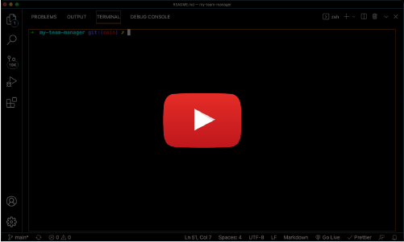
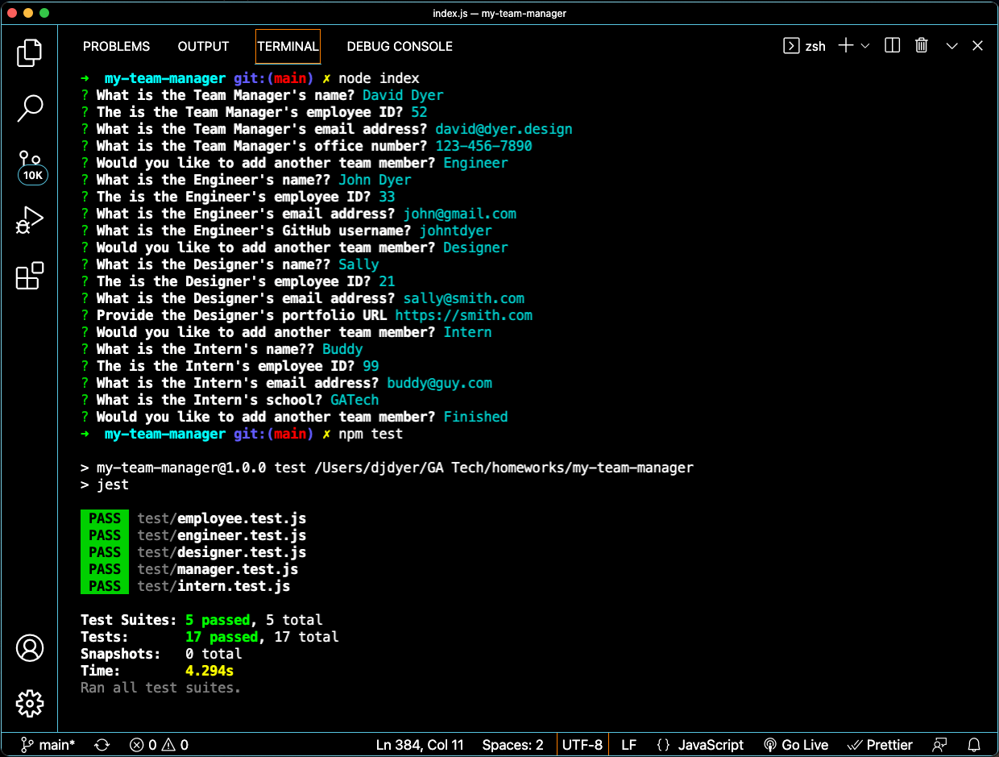
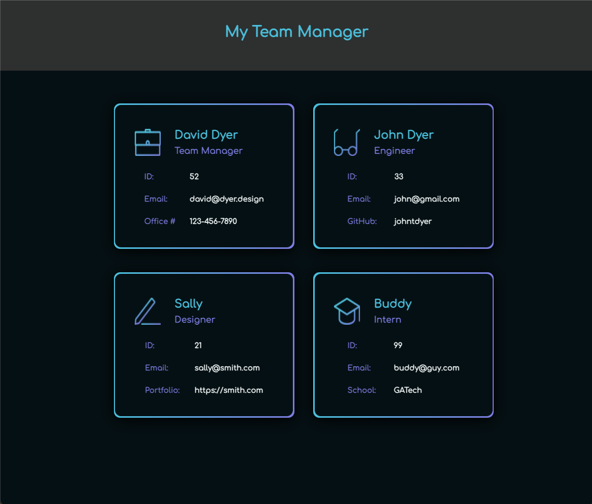

# my-team-manager

<br />

## Table of Contents

- [Description](#description)
- [User Story](#user-story)
- [Installation](#installation)
- [License](#license)
- [Screenshots/Demo](#screenshots-demo)
- [Criteria](#acceptance-criteria)
- [Testing](#testing)
- [Collaboration](#collaboration)

<br />

## Description

A Node.js command-line application that accepts user information about employees on software engineering team, and then generates an HTML webpage that displays a summary of each team member.

<br />

## User Story

```md
AS A manager
I WANT to generate a webpage that displays my team's basic info
SO THAT I have quick access to their emails and GitHub profiles
```

<br />

## Installation

Application uses [Inquirer](https://www.npmjs.com/package/inquirer) for collecting input and will run with `npm install`. Must type `node index` in command-line to initialize.

<br />

## License

 <br />
Copyright (c) David Dyer [2021]

[license](https://choosealicense.com/licenses/isc/)

<br />

## Screenshots / Demo

[](https://youtu.be/JRo6DSLCqNw)

<br />




<br />

## Acceptance Criteria

```
Command-line application accepts user input.

Team Manager initializes app by providing name, employee ID, email address, and office number.

Then is presented with menu to add more team members or finish building team.

When selecting the Engineer option, is prompted to provide name, employee ID, email address and github.

When selecting the Designer option, is prompted to provide name, employee ID, email address and porfolio link.

When selecting the Intern option, is prompted to provide name, employee ID, email address, and school.

After finishing team, an HTML file is generated to display all details.

Email address clicks to populate default email program with TO field loaded.

GitHub username clicks to open profile in new tab.

Portfolio link clicks to open portfolio in new tab.

```

<br />

## Testing

Application uses [Jest](https://www.npmjs.com/package/jest) by running `npm test` in command line.

<br />

## Collaboration

Development efforts most often include guidance from Jedi Master: **Chris Champness**

<a href= "https://github.com/CChampness"></a>

Working alongside the likes of:  
**Olsen Ogouchi**

<a href="https://github.com/Chrisolsen1993"></a>

<br />

**Reporting issues**:  
Contact [djdyer](https://www.github.com/djdyer) to report bugs.

<br />

**Contributions**:  
Clone branch, submit pull request for review after completing any improvements.

<br />
<br />

Thanks for taking a look!  
👋
